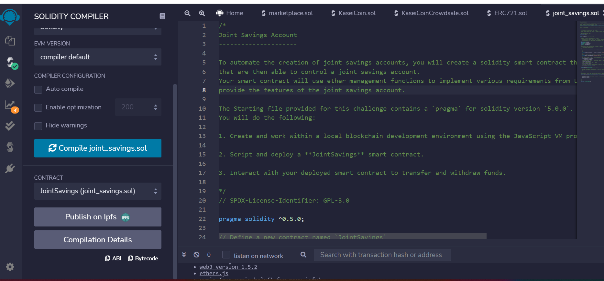
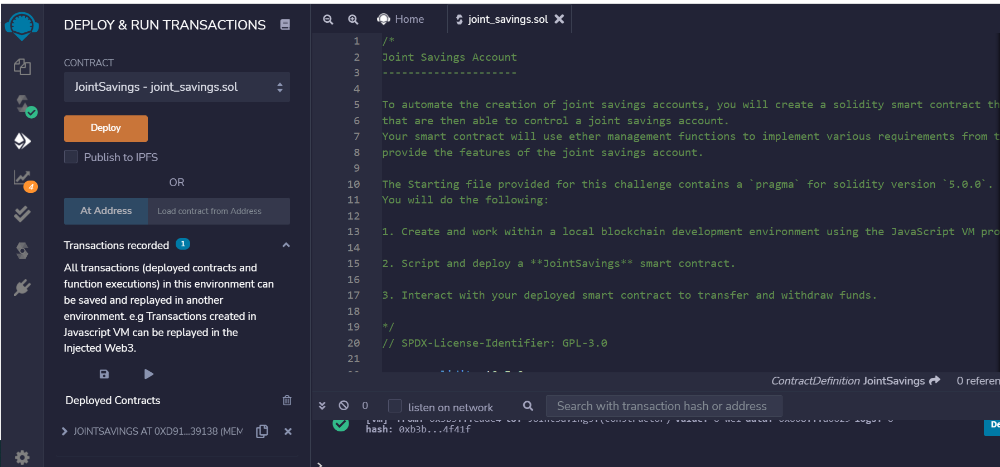
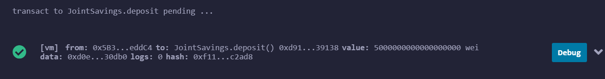
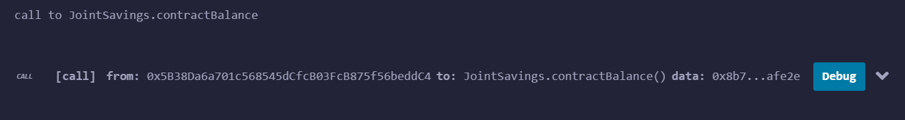
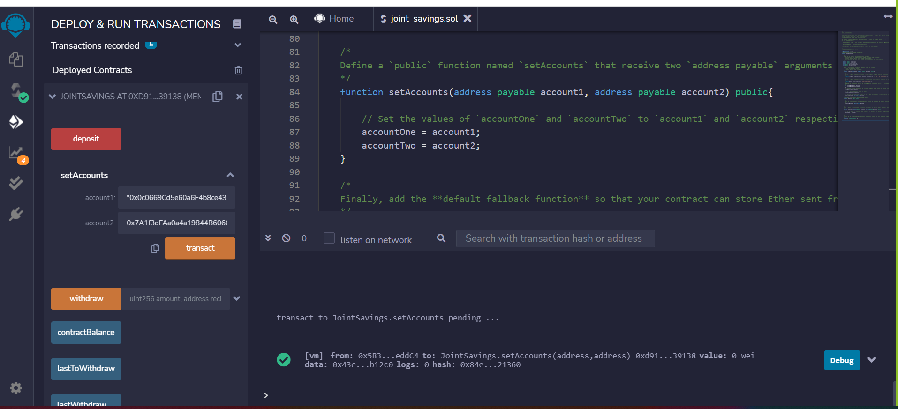
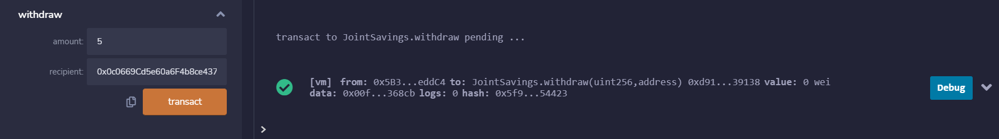
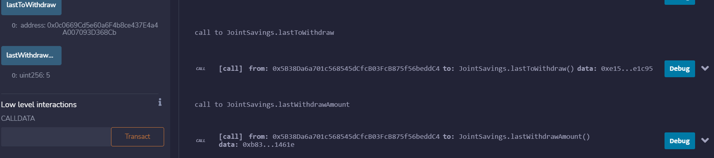
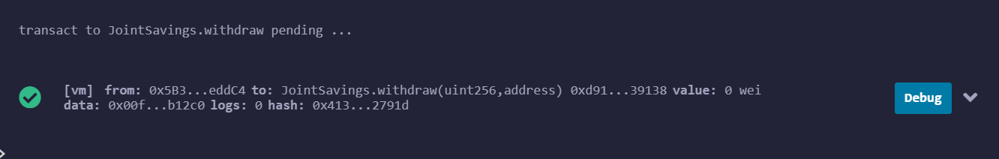
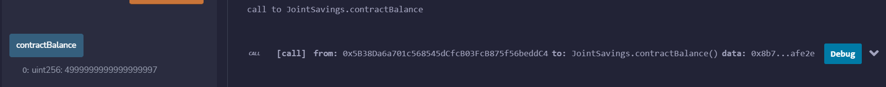
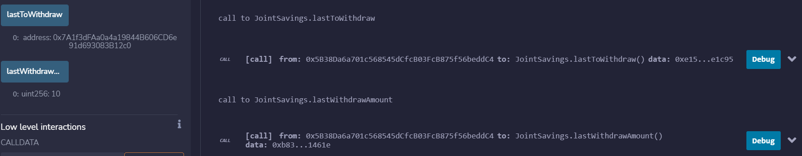

# Joint_Savings

Joint Savings is a smart contract, compatible with Ethereum-compatible blockchain that connects financial institutions, and helps automate many of the institutions’ financial processes and features, such as hosting joint savings accounts.

# Usage

Joint Savings Solidity smart contract accepts two user addresses which will have control capability over a joint savings account. 
The smart contractuses Ether management functions to implement a financial institution’s requirements for providing the features of the joint savings account, such as deposit and withdraw funds from the account.

# Visualization

# Contributing

Pull requests are welcome. Please open an issue to discuss before executing any changes.
Please make sure to update tests as needed.

# License
BSD-2-Clause https://opensource.org/licenses/BSD-2-Clause
